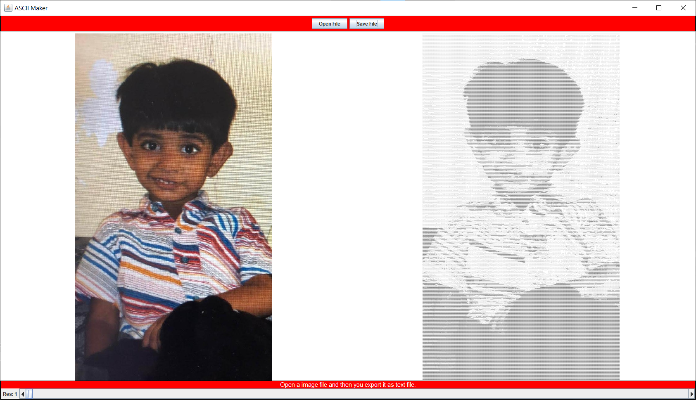

# Image-to-ASCII
Convert images to ASCII based on brightness values. The resolution, controls the font size; so lower the resolution, the better. Also to get the full effect, save the file as a text file, and then open it up in a editor that can change the font size and font type to Courier New. 

Example: Converting my baby picture to ASCII

  

